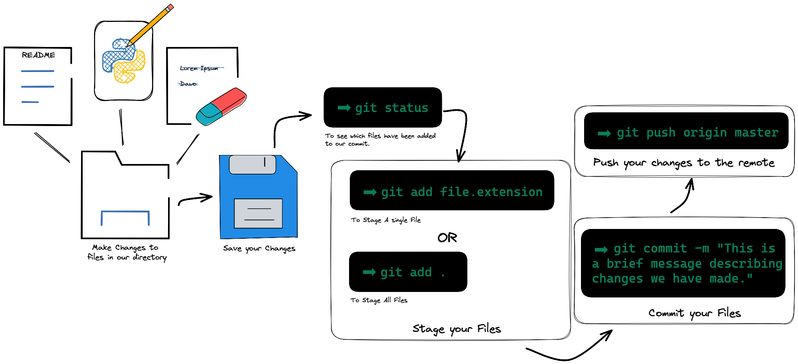

# Introduction to GitHub and the Terminal

1.  **[Introduction](#1-introduction)**
2.  **[GitHub: Getting Started](#2-github-getting-started)**
3.  **[Terminal: Basics and Navigation](#3-terminal-basics-and-navigation)**
4.  **[Practical Applications and Key Concepts](#4-practical-applications-and-key-concepts)**
5.  **[Git: Basics and Key Concepts](#5-git-basics-and-key-concepts)**
6.  **[Exploring .gitignore](#6-exploring-gitignore)**


### 1. Introduction

In this lesson, we'll discuss two essential programming and software development tools: GitHub and the Terminal. GitHub is a web-based hosting service that's perfect for version control, especially when working on team projects. Meanwhile, the Terminal is a powerful tool that allows you to navigate your computer and execute commands.

### 2. GitHub: Getting Started

#### 2.1 Signing Up

To start using GitHub, you first need to sign up for an account. Follow these steps:

1.  Navigate to [GitHub.com](https://github.com/).
2.  Click on the "Sign up" button on the top right corner of the page.
3.  Fill in your chosen username, email address, and password. Then click "Create account".
4.  Verify your email address by clicking on the link sent to your email.
5.  Once your account is set up, log in to access the GitHub dashboard.

#### 2.2 Creating a Repository

After setting up your account, let's create your first repository:

1.  Click on the '+' icon at the top right corner of the GitHub dashboard, then select "New repository".
2.  Name your repository and provide a short description.
3.  Choose whether you want your repository to be public or private.
4.  Check the box for "Initialize this repository with a README" – this is a good practice as it explains what your project is about.
5.  Click "Create repository" to finish the process.

### 3. Terminal: Basics and Navigation

#### 3.1 Accessing the Terminal

To access the Terminal, the steps will vary depending on your operating system. Users of Windows can use PowerShell or Command Prompt, while those on macOS and Linux can access the Terminal.

#### 3.2 Basic Commands

Here are some basic commands you can try in your terminal:

 This command creates a new file. To use it, type `touch [file name]`.

| Command | Description                                               | Example                                                                                   |
| ------- | --------------------------------------------------------- | ----------------------------------------------------------------------------------------- |
| `pwd`   | Prints the name of the current directory.                 | `pwd`                                                                                     |
| `ls`    | Lists all files and directories in the current directory. | `ls`                                                                                      |
| `cd`    | Changes the current directory.                            | `cd ..` (to go up one level) <br> `cd [directory name]` (to go into a specific directory) |
| `mkdir` | Creates a new directory.                                  | `mkdir [directory name]`                                                                  |
| `touch` | Creates a new file.                                       | `touch [file name]`                                                                       |


### 4. Practical Applications and Key Concepts

#### 4.1 Understanding Paths

Effective directory navigation requires an understanding of file paths. There are two types of paths to consider: absolute and relative paths. Absolute paths start from the root directory and give the exact location of a file or directory. Relative paths, on the other hand, start from the current directory.

#### 4.2 Identifying and Viewing Hidden Files

By default, the Terminal doesn't show hidden files. These files usually start with a dot (`.`), for example, `.gitignore`. To view hidden files, use `ls -a`.

After completing this lesson, you will have gained the necessary skills to navigate GitHub and the Terminal effectively. These tools are crucial components in programming and software development.

### 5. Git: Basics and Key Concepts

#### 5.1 What is Git?

Git is a version control system that enables multiple people to work on a project simultaneously without interfering with each other's work. It is open-source software that is free to use and essential for any programming or software development project.

#### 5.2 Key Terms and Concepts

Here are some common terms and concepts in Git:

| Term              | Description                                                                                     |
| ----------------- | ----------------------------------------------------------------------------------------------- |
| Repository (repo) | The project folder containing all the files and their revision history.                         |
| Commit            | A saved change or set of changes in the repo, with a unique ID for tracking purposes.           |
| Branch            | A separate version of the repo for working on new features without affecting the main codebase. |
| Clone             | A copy of the repo that resides on your computer instead of on a server.                        |
| Pull              | A command that updates your local version of a repo to the newest commit.                       |
| Push              | A command that sends your committed changes to a remote repo.                                   |

#### 5.3 Basic Git Commands

Here are some basic commands you can use in Git:

| Command                      | Description                                                                   | Example                                          |
| ---------------------------- | ----------------------------------------------------------------------------- | ------------------------------------------------ |
| `git clone [URL]`            | Clones (downloads) a repository from GitHub to your local machine             | `git clone https://github.com/username/repo.git` |
| `git status`                 | Shows the status of changes as untracked, modified, or staged                 | `git status`                                     |
| `git add [file]`             | Adds a file to the staging area in preparation for a commit                   | `git add index.html`                             |
| `git commit -m "[message]"`  | Commits the staged snapshot with a brief description                          | `git commit -m "Add index.html"`                 |
| `git pull`                   | Fetches and merges changes on the remote server to your working directory     | `git pull origin main`                           |
| `git push`                   | Pushes all committed changes in the local repository to the remote repository | `git push origin main`                           |
| `git branch`                 | Lists all local branches in the current repository                            | `git branch`                                     |
| `git checkout [branch-name]` | Switches to the specified branch and updates the working directory            | `git checkout new-feature`                       |
| `git merge [branch-name]`    | Merges the specified branch’s history into the current branch                 | `git merge new-feature`                          |

With these basic commands, you'll be able to start using Git for your projects. It may seem intimidating at first, but with practice, you'll find it's an incredibly powerful tool for collaborative work.

#### 5.4 The Quintessential Git Workflow

The average Git workflow looks something like this:



### 6. Exploring .gitignore

#### 6.1 Grasping .gitignore

A .gitignore file serves as a guide for Git to identify which files or directories should be excluded from the project. These may include local configuration files, build directories, system files, log files, or compiled code that you may not want Git to track in your repository.

#### 6.2 Constructing a .gitignore file

Creating a .gitignore file is a simple process. You can manually create it in the root directory of your repository and enter the names of the files and directories you want to keep hidden from Git.

To give you an idea, here's a sample .gitignore file for a Python project:

```shell
# Excusing Python build directories
__pycache__/
*.py[cod]

# Steering clear of all log files
*.log

# Bypassing the virtual environment folder
venv/

# Overlooking OS-specific files
.DS_Store
Thumbs.db
```

In the sample above, the # symbol is wielded to add commentary to the .gitignore file.